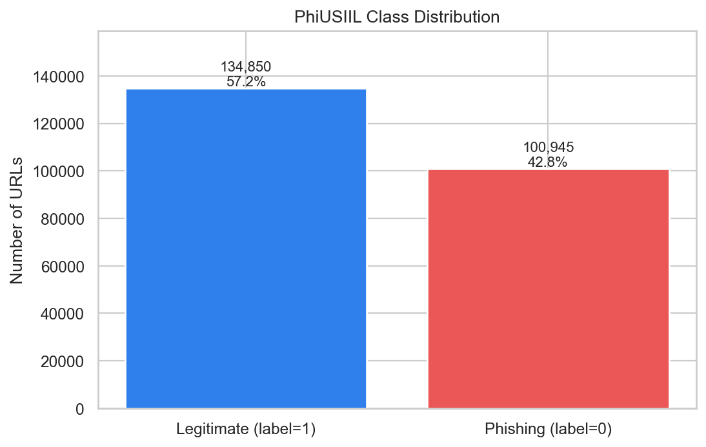
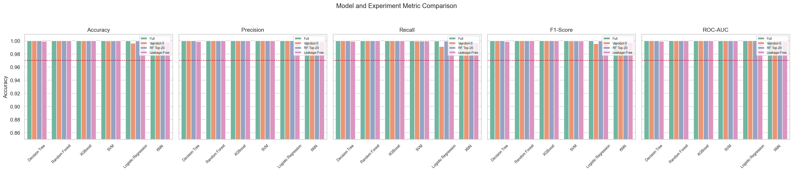
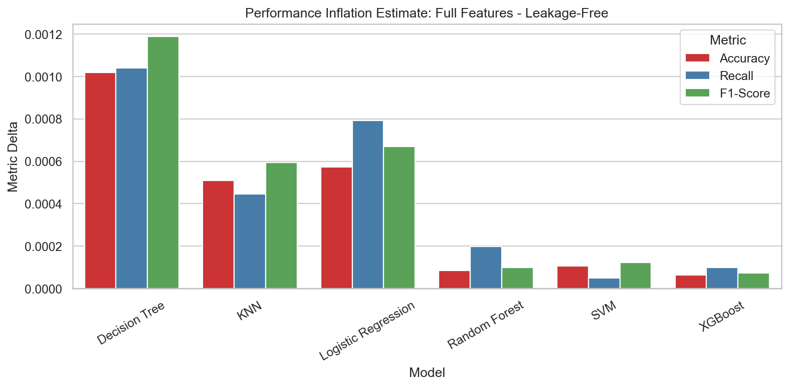
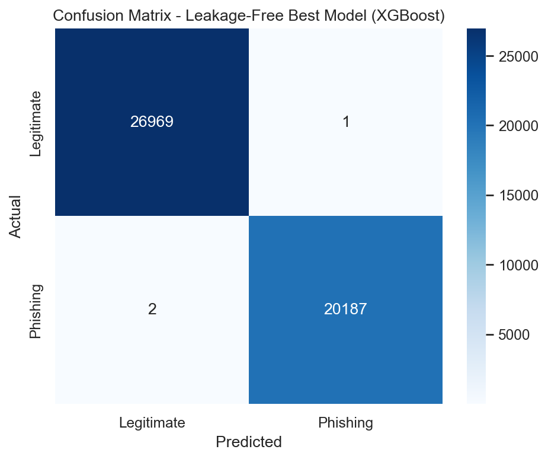
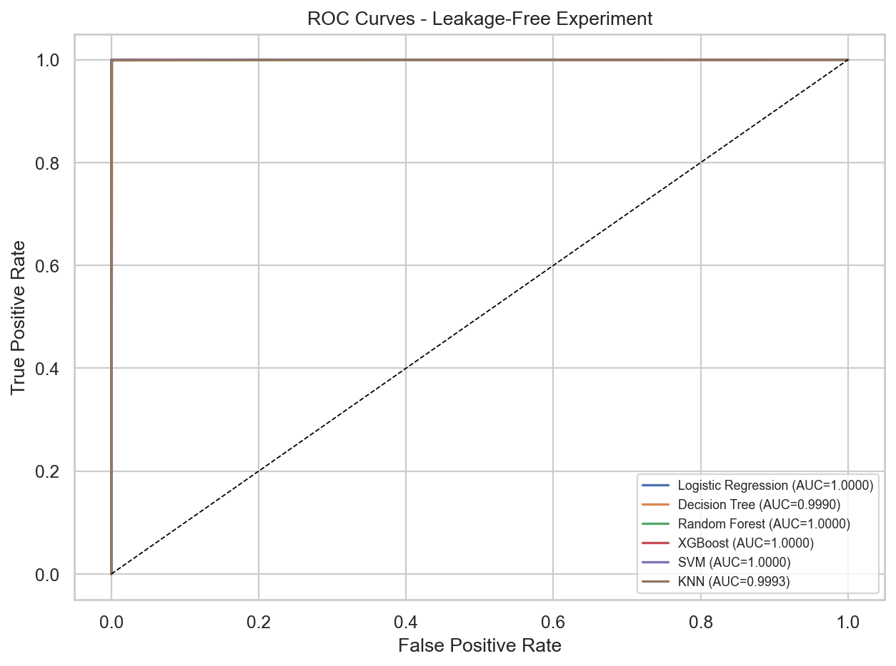
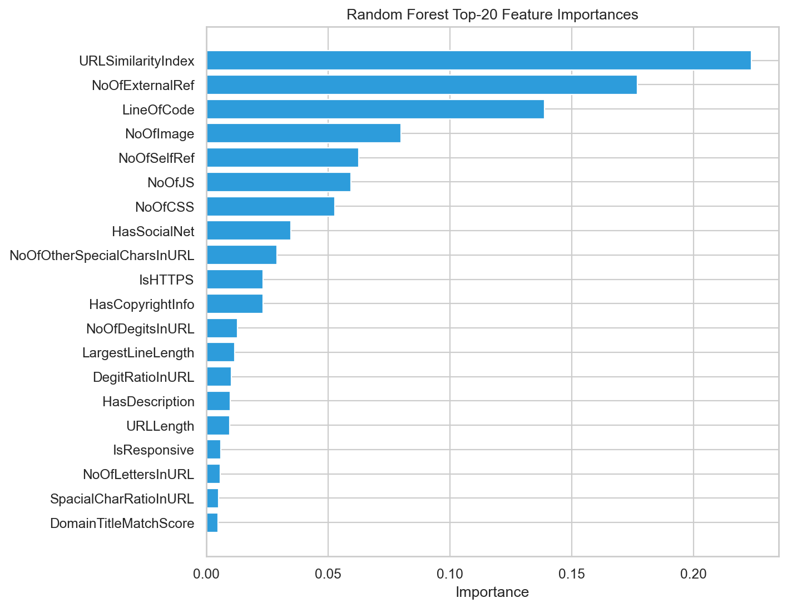

# Makine Ogrenmesi ile Phishing URL Tespiti: Leakage-Aware PhiUSIIL Analizi

Eren Terakye ve proje grubu, Eskisehir Osmangazi Universitesi Bilgisayar Muhendisligi Bolumu

## Oz

Bu calismada PhiUSIIL Phishing URL veri seti uzerinde klasik makine ogrenmesi algoritmalari karsilastirilmis ve veri seti yapisindan kaynaklanabilecek etiket sizintisi deneysel olarak incelenmistir. Logistic Regression, Decision Tree, Random Forest, XGBoost, SVM ve KNN modelleri tam ozellik seti, Vajrobol-5, RF Top-20 ve leakage-free ozellik setleri ile degerlendirilmistir. Leakage-free deneyde en iyi model XGBoost olmus; accuracy 99.99%, recall 99.99%, F1-score 99.99% ve ROC-AUC 1.0000 elde edilmistir. Bulgular, tam ozellik setindeki cok yuksek sonuclarin bir bolumunun sızıntılı ozelliklerden etkilendigini gostermektedir.

## Abstract

This study compares classical machine learning algorithms on the PhiUSIIL Phishing URL dataset and evaluates the effect of construction-time label leakage. Logistic Regression, Decision Tree, Random Forest, XGBoost, SVM, and KNN are tested under full-feature, Vajrobol-5, RF Top-20, and leakage-free settings. The leakage-free setting provides a more defensible estimate of real-world model behavior.

## 1. Giris

Phishing saldirilari kullanicilari sahte web sayfalari veya URL'ler uzerinden kandirarak kimlik bilgileri, finansal veriler ve kurumsal hesaplar icin ciddi risk olusturur. URL tabanli tespit yaklasimlari, kullanici tarafinda hizli karar verebildigi icin pratik bir savunma katmani sunar. Ancak literaturde raporlanan cok yuksek basarim degerleri, veri setinin toplanma ve ozellik uretme sureci nedeniyle dikkatli yorumlanmalidir.

Bu calismanin amaci yalnizca en yuksek accuracy degerini elde etmek degildir. Ana katkı, PhiUSIIL veri setinde sızıntılı olabilecek ozelliklerin etkisini ayirarak modellerin daha gercekci kosullarda nasil davrandigini gostermektir.

## 2. Bilimsel Yazin Taramasi

Prasad ve Chandra (2024), PhiUSIIL veri setini ve similarity index ile desteklenen incremental learning yaklasimini tanitmistir. Vajrobol ve diğ. (2024), mutual information ile secilen bes ozellik ve Logistic Regression kullanarak cok yuksek basarim raporlamistir. Yoon ve diğ. (2024) URL, HTML ve graf temsillerini derin ogrenme mimarileriyle birlestirmis; Rao ve diğ. (2025) mobil senaryo icin Super Learner ensemble onermistir. Taha ve diğ. (2024) klasik ML modellerini daha kucuk bir phishing veri setinde karsilastirmistir. Kytidou ve diğ. (2025) ise veri seti kalitesi, concept drift ve aciklanabilirlik sorunlarini phishing tespitinin temel acik problemleri arasinda tartismistir.

**Tablo 1. Literatür ve Bu Çalışmanın Karşılaştırılması**

| Kaynak | Yontem | Veri Seti | Accuracy | F1 | Recall | Not |
| --- | --- | --- | --- | --- | --- | --- |
| Prasad & Chandra (2024) | BernoulliNB + Passive-Aggressive + SGD | PhiUSIIL | 99.24% | 99.21% | - | PhiUSIIL veri setini ve incremental learning yaklasimini tanitir. |
| Vajrobol vd. (2024) | Mutual information + Logistic Regression | PhiUSIIL | 99.97% | 99.97% | - | URLSimilarityIndex dahil 5 ozellik kullanir. |
| Yoon vd. (2024) | CNN + Transformer + GCN | Common Crawl + PhishTank | 98.12% | 97.89% | - | URL/HTML/graf temsillerini birlikte kullanir. |
| Rao vd. (2025) | Hybrid Super Learner ensemble | PhishDump | 98.93% | - | - | Mobil cihaz senaryosunda stacking yaklasimi. |
| Taha vd. (2024) | LR, DT, RF, AdaBoost, XGBoost | UCI Phishing Websites | 96.89% | - | - | Kucuk veri setinde klasik ML karsilastirmasi. |
| Bu Calisma (2026) | Leakage-free XGBoost | PhiUSIIL | 99.99% | 99.99% | 99.99% | Sizintili ozellikler cikarilarak degerlendirildi. |
| Bu Calisma (2026) | Vajrobol-5 Logistic Regression replikasyonu | PhiUSIIL | 99.63% | 99.56% | 99.13% | URLSimilarityIndex dahil literatur replikasyonu. |

## 3. Yontem

Veri seti 235.795 URL orneginden olusmaktadir. Hedef degisken label sutunudur; 1 mesru, 0 phishing URL anlamina gelir. FILENAME, URL, Domain ve Title tanimlayici sutunlari model egitiminden cikarilmistir. TLD kategorik degiskeni egitim verisine gore encode edilmis, sayisal ozellikler StandardScaler ile yalnizca egitim setine fit edilerek olceklendirilmistir. Train/test ayrimi stratified 80/20 ve random_state=42 ile yapilmistir.

Dort deney tanimlanmistir: tam ozellik seti, Vajrobol-5 ozellikleri, Random Forest Top-20 ozellikleri ve leakage-free ozellik seti. Leakage-free deneyde URLSimilarityIndex, URLCharProb, TLDLegitimateProb ve URLTitleMatchScore cikarilmistir. Bu ozellikler veri seti olusturulurken mesru URL listesi veya mesru site istatistikleri ile iliskili oldugu icin etikete yakin vekil degiskenler gibi davranabilir.

## 4. Bulgular

Tam ozellik setinde en iyi model Decision Tree olmus ve accuracy 100.00% olarak olculmustur. Vajrobol-5 replikasyonunda Logistic Regression accuracy degeri 99.63% seviyesine ulasmistir. Ancak leakage-free deney, bu yuksek degerlerin gercek dunya genellenebilirligini tek basina garanti etmedigini gostermektedir.

**Tablo 2. Tam Özellik Seti Sonuçları**

| Model | Accuracy | Precision | Recall | F1-Score | ROC-AUC | Train Time (s) |
| --- | --- | --- | --- | --- | --- | --- |
| Decision Tree | 100.00% | 100.00% | 100.00% | 100.00% | 1.0000 | 0.33 |
| Random Forest | 100.00% | 100.00% | 100.00% | 100.00% | 1.0000 | 2.39 |
| XGBoost | 100.00% | 100.00% | 100.00% | 100.00% | 1.0000 | 0.43 |
| SVM | 99.99% | 100.00% | 99.98% | 99.99% | 1.0000 | 0.53 |
| Logistic Regression | 99.99% | 100.00% | 99.97% | 99.99% | 1.0000 | 0.14 |
| KNN | 99.86% | 99.93% | 99.74% | 99.83% | 0.9995 | 0.01 |

**Tablo 3. Vajrobol-5 Replikasyon Sonuçları**

| Model | Accuracy | Precision | Recall | F1-Score | ROC-AUC | Train Time (s) |
| --- | --- | --- | --- | --- | --- | --- |
| XGBoost | 99.99% | 100.00% | 99.99% | 99.99% | 1.0000 | 0.21 |
| Random Forest | 99.99% | 100.00% | 99.98% | 99.99% | 1.0000 | 1.78 |
| KNN | 99.99% | 100.00% | 99.98% | 99.99% | 0.9999 | 0.04 |
| Decision Tree | 99.99% | 99.99% | 99.99% | 99.99% | 0.9999 | 0.12 |
| SVM | 99.97% | 99.99% | 99.95% | 99.97% | 1.0000 | 0.05 |
| Logistic Regression | 99.63% | 100.00% | 99.13% | 99.56% | 1.0000 | 0.08 |

**Tablo 4. RF Top-20 Sonuçları**

| Model | Accuracy | Precision | Recall | F1-Score | ROC-AUC | Train Time (s) |
| --- | --- | --- | --- | --- | --- | --- |
| Decision Tree | 100.00% | 100.00% | 100.00% | 100.00% | 1.0000 | 0.19 |
| Random Forest | 100.00% | 100.00% | 100.00% | 100.00% | 1.0000 | 2.08 |
| XGBoost | 100.00% | 100.00% | 100.00% | 100.00% | 1.0000 | 0.25 |
| SVM | 99.97% | 100.00% | 99.94% | 99.97% | 1.0000 | 0.18 |
| KNN | 99.97% | 99.99% | 99.94% | 99.96% | 0.9999 | 0.01 |
| Logistic Regression | 99.97% | 100.00% | 99.92% | 99.96% | 1.0000 | 0.08 |

**Tablo 5. Leakage-Free Sonuçlar**

| Model | Accuracy | Precision | Recall | F1-Score | ROC-AUC | Train Time (s) |
| --- | --- | --- | --- | --- | --- | --- |
| XGBoost | 99.99% | 100.00% | 99.99% | 99.99% | 1.0000 | 0.51 |
| Random Forest | 99.99% | 100.00% | 99.98% | 99.99% | 1.0000 | 3.26 |
| SVM | 99.98% | 99.98% | 99.98% | 99.98% | 1.0000 | 0.53 |
| Logistic Regression | 99.93% | 99.95% | 99.89% | 99.92% | 1.0000 | 0.18 |
| Decision Tree | 99.90% | 99.87% | 99.90% | 99.88% | 0.9990 | 1.27 |
| KNN | 99.81% | 99.86% | 99.69% | 99.77% | 0.9993 | 0.01 |

**Tablo 6. Sızıntı Etkisi: Tam Özellik - Leakage-Free**

| Model | Accuracy Delta | Recall Delta | F1 Delta |
| --- | --- | --- | --- |
| Decision Tree | 0.0010 | 0.0010 | 0.0012 |
| KNN | 0.0005 | 0.0004 | 0.0006 |
| Logistic Regression | 0.0006 | 0.0008 | 0.0007 |
| Random Forest | 0.0001 | 0.0002 | 0.0001 |
| SVM | 0.0001 | 0.0000 | 0.0001 |
| XGBoost | 0.0001 | 0.0001 | 0.0001 |

*Şekil 1. PhiUSIIL sınıf dağılımı*

*Şekil 2. Deney ve model bazlı metrik karşılaştırması*

*Şekil 3. Tam özellik seti ile leakage-free sonuçlar arasındaki fark*

*Şekil 4. Leakage-free en iyi model için karmaşıklık matrisi*

*Şekil 5. Leakage-free deney ROC eğrileri*

*Şekil 6. Random Forest Top-20 özellik önemleri*

## 5. Tartisma

Sonuclar iki katmanli yorumlanmalidir. Ilk katmanda, PhiUSIIL uzerindeki klasik makine ogrenmesi modelleri yuksek ayirt edicilik gostermektedir. Ikinci katmanda, bazi ozelliklerin veri seti insa sureciyle iliskili olmasi model basarimini sisirebilir. Bu nedenle tam ozellik seti literaturle karsilastirma icin yararli, leakage-free deney ise uygulama davranisini tartismak icin daha guvenilir kabul edilmelidir.

## 6. Sonuclar

Bu calismada PhiUSIIL veri seti uzerinde alti makine ogrenmesi modeli sistematik olarak karsilastirilmis, literaturdeki Vajrobol-5 bulgusu yeniden denenmis ve sızıntılı ozelliklerin etkisi deneysel olarak ayrilmistir. Literatürdeki kaynaklardan farkli olarak bu calisma, yalnizca yuksek dogruluk raporlamak yerine ayni veri setindeki potansiyel construction-time leakage etkisini acikca gosterir ve temiz ozellik setiyle daha savunulabilir bir performans degerlendirmesi sunar.

Gelecek calismalarda zaman bazli ayrim, farkli kaynaklardan toplanmis dis test seti, esik optimizasyonu ve SHAP/LIME gibi aciklanabilirlik yontemleriyle model davranisi daha ayrintili incelenebilir.

## Araştırma ve Yayın Etiği

Bu çalışma açık erişimli veri seti ve literatür kaynakları kullanılarak hazırlanmıştır. Literatürden alınan bilgiler sentezlenmiş, metin öğrencilerin kendi cümleleriyle yazılmıştır.

## Çıkar Çatışması

Yazarlar tarafından herhangi bir çıkar çatışması beyan edilmemiştir.

## NOT

Bu proje başka bir derste proje olarak kullanılmamıştır ve kullanılması planlanmamaktadır.

## Kaynaklar

Prasad, A. ve Chandra, S. (2024). PhiUSIIL: A diverse security profile empowered phishing URL detection framework based on similarity index and incremental learning. Computers & Security, 136, 103545. https://doi.org/10.1016/j.cose.2023.103545

Vajrobol, V., Gupta, B. B. ve Gaurav, A. (2024). Mutual information based logistic regression for phishing URL detection. Cyber Security and Applications, 2, 100044. https://doi.org/10.1016/j.csa.2024.100044

Yoon, J.-H., Buu, S.-J. ve Kim, H.-J. (2024). Phishing Webpage Detection via Multi-Modal Integration of HTML DOM Graphs and URL Features Based on Graph Convolutional and Transformer Networks. Electronics, 13(16), 3344. https://doi.org/10.3390/electronics13163344

Rao, R. S., Kondaiah, C., Pais, A. R. ve Lee, B. (2025). A hybrid super learner ensemble for phishing detection on mobile devices. Scientific Reports. https://doi.org/10.1038/s41598-025-02009-8

Taha, M. A., Jabar, H. D. A. ve Mohammed, W. K. (2024). A Machine Learning Algorithms for Detecting Phishing Websites: A Comparative Study. Iraqi Journal for Computer Science and Mathematics. https://doi.org/10.52866/ijcsm.2024.05.03.015

Kytidou, E., Tsikriki, T., Drosatos, G. ve Rantos, K. (2025). Machine learning techniques for phishing detection: A review of methods, challenges, and future directions. Intelligent Decision Technologies. https://doi.org/10.1177/18724981251366763
